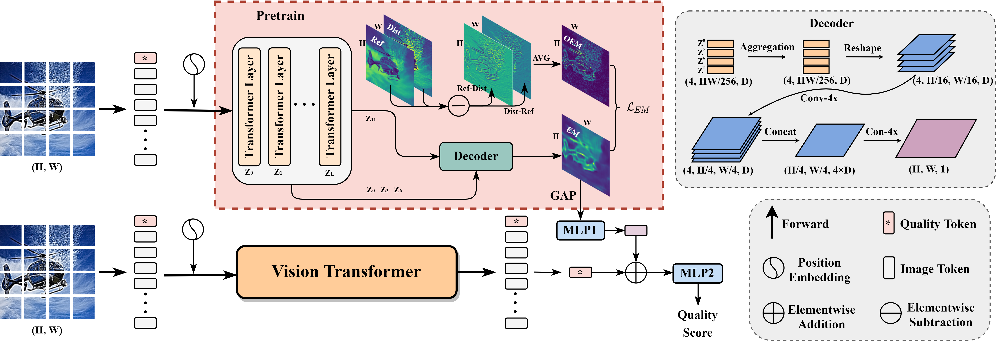
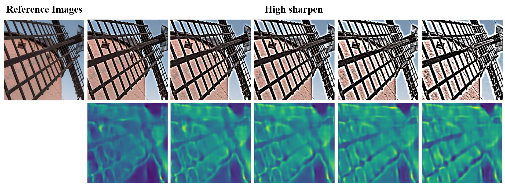
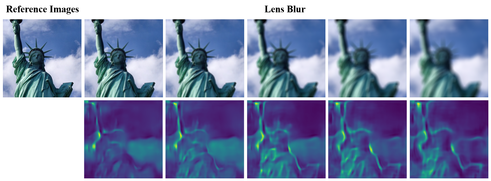
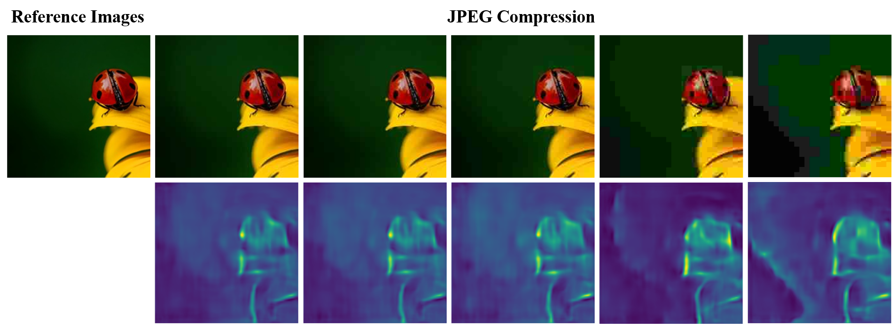
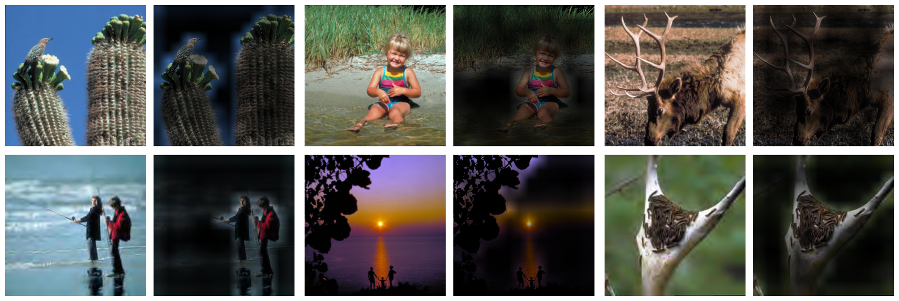
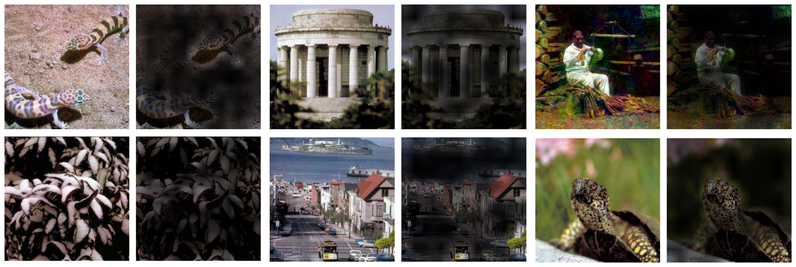
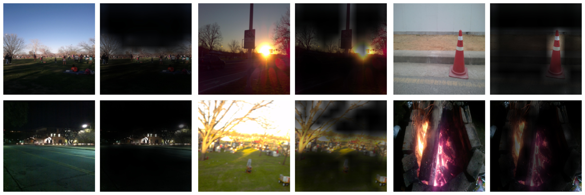

# Blind Image Quality Assessment via Transformer Predicted Error Map and Perceptual Quality Token

 


## Environment
  

> pip install -r  requirements


## Datasets

In this work we use 6 datasets ([LIVE](https://live.ece.utexas.edu/research/quality/subjective.htm), [CSIQ](http://vision.eng.shizuoka.ac.jp/mod/page/view.php?id=23), [TID2013](http://www.ponomarenko.info/tid2013.htm), [KADID10K](http://database.mmsp-kn.de/kadid-10k-database.html), [LIVE challenge](https://live.ece.utexas.edu/research/ChallengeDB/), [KonIQ](http://database.mmsp-kn.de/koniq-10k-database.html), [LIVEFB](https://baidut.github.io/PaQ-2-PiQ/))


## Training

1. Pre-train model for EM. 

   ```python
   python train_pre.py
   ```

2. Final model for score prediction.

   ``` python
   python train_final.py
   ```


## Pretrained Models

Pretrained models will be released soon.


## Visualization

### 1. Predicted Error Maps









### 2. Perceptual Attention Maps








